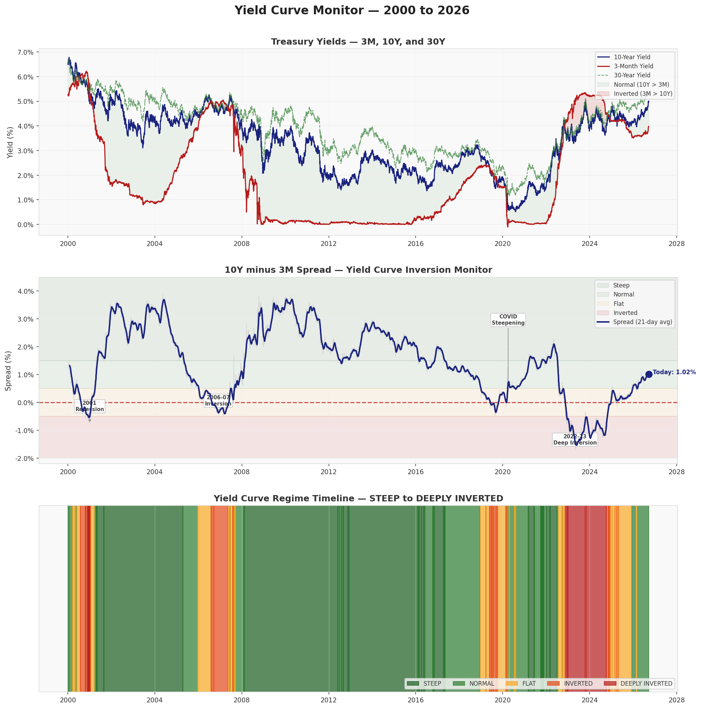
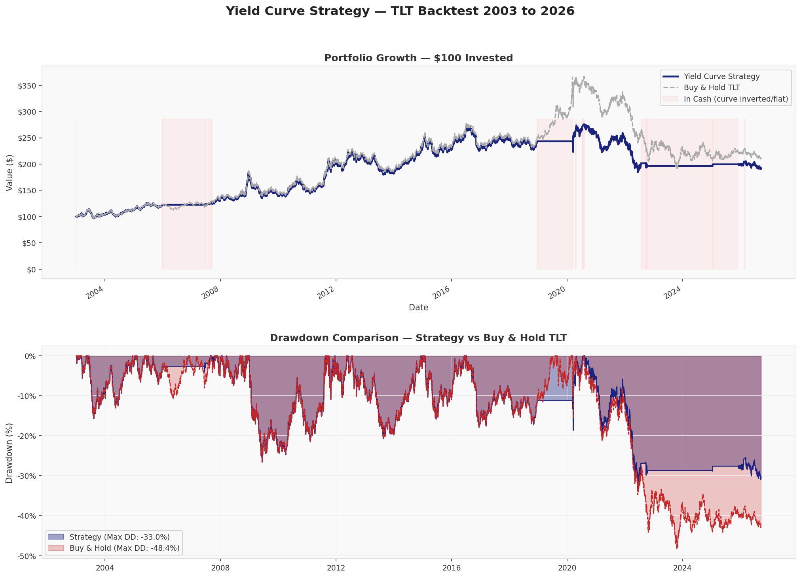

# Yield Curve Monitor
### Fixed Income Relative Value Tool | Sidney Pratt

---

## Overview
This model tracks the US Treasury yield curve across four maturities —
3-month, 5-year, 10-year, and 30-year — and classifies the current
regime as Steep, Normal, Flat, Inverted, or Deeply Inverted based on
the classic 10Y minus 3M spread.

Built specifically to complement a fixed income relative value research
portfolio. The yield curve is the single most watched indicator across
every fixed income trading desk — rates, credit, and mortgages.

---

## Key Features
- Live Treasury yield data downloaded fresh on every run
- Regime classification across 5 curve states
- Plain language interpretation of what the curve is saying
- Dynamic signal and strategy recommendation that updates with regime
- 30-day and 90-day trend detection — steepening or flattening
- Backtest of a TLT bond strategy using curve signals 2003 to 2026
- Key historical event annotations — 2001, 2006, 2020, 2022-23

---

## Why It Matters
The yield curve is the most cited indicator in fixed income markets.
Every rates, credit, and mortgage desk watches the 10Y minus 3M spread
daily because it predicts recessions, Fed policy shifts, and bond market
direction before they happen.

Every major US recession since 1970 has been preceded by a yield curve
inversion. The 2022-23 inversion was the deepest since the 1980s at
-1.70% — and TLT fell over 48% peak to trough during that period.

- **Rates desk:** curve shape determines duration and bond strategy
- **Credit desk:** inversions predict credit stress and widening spreads
- **Mortgage desk:** curve affects prepayment speeds and MBS pricing

---

## Methodology
The model downloads live US Treasury yield data across four maturities
and calculates the 10Y minus 3M spread — the classic Federal Reserve
inversion signal. A 21-day rolling average smooths daily noise.

The spread is classified into one of five regimes using fixed thresholds.
A simple strategy holds TLT (20+ year Treasury ETF) during Normal and
Steep regimes and moves to cash during Flat and Inverted regimes.
The backtest runs from 2003 to present with no lookahead bias.

**This methodology does not change regardless of the date range selected.**

---

## Regime Classification

| Regime | 10Y minus 3M Spread | Strategy Signal |
|--------|---------------------|-----------------|
| Steep | Above +1.50% | HOLD TLT |
| Normal | +0.50% to +1.50% | HOLD TLT |
| Flat | -0.50% to +0.50% | MOVE TO CASH |
| Inverted | -0.50% to 0% | MOVE TO CASH |
| Deeply Inverted | Below -0.50% | MOVE TO CASH |

---

## Dynamic Results
*The following update every time the model is run based on selected dates.*

**Signal** — Current regime classification based on the latest data point
in the selected date range.

**Strategy Signal** — HOLD TLT or MOVE TO CASH based on current regime.

**Results** — Total return, annualized return, volatility, Sharpe ratio,
and max drawdown for both the strategy and buy and hold TLT.

**Summary & Key Findings** — Plain language explanation of what the
current regime means for markets and investors.

**What to Watch** — Four specific indicators to monitor given the
current regime.

**Historical Context** — Average spread, deepest inversion, steepest
curve, and percentage of time inverted — all calculated within the
selected date range.

**Charts** — Three charts: Treasury yields over time, 10Y minus 3M
spread with regime shading, and regime timeline from Steep to
Deeply Inverted.

---

## Charts

---

## Tools & Technologies
- **Python** — core programming language
- **yfinance** — live US Treasury yield data
- **pandas & numpy** — data processing and calculations
- **matplotlib** — chart generation
- **Streamlit** — live interactive web application
- **Google Colab** — development environment

---

## Full Research Notebook
View the complete Yield Curve Monitor including all code, charts,
backtest results, and analysis:

github.com/sidneyppratt-svg/yield-curve-monitor

---

## About
Sidney Pratt is a Finance and Economics student at Western Michigan
University and an ACHA D1 hockey player building a quantitative
research portfolio targeted at fixed income trading internships.

sidneyppratt.com | github.com/sidneyppratt-svg
